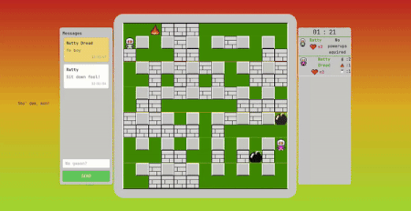

# bomberman-dom 

## Introduction

Welcome to our Bomberman game, a multiplayer arena game built using a custom mini-framework and powered by WebSockets. This game allows multiple players to compete against each other in a classic Bomberman-style arena.

### Getting Started

#### Prerequisites

    A WebSocket-enabled browser or client
    A compatible device (keyboard)

#### Running the Game

    Pull the repo
    `cd bomberman-dom/frontend`
    `npm i`
    `cd ../bomberman-dom/backend`
    `go run .`
    Open the page in a browser. Needs 2 or more players to start the game.
    Start playing!

#### Gameplay

    Move your character using the arrow keys.
    Drop bombs with space to destroy obstacles and opponents.
    Collect power-ups to gain advantages.
    Be the last player standing to win!

## Technical Details

### WebSocket Connection

Our game uses WebSockets to handle all game actions, including player movement, bomb drops, and power-up collection. The WebSocket connection is established between the client and server, enabling real-time communication and synchronization.

### Custom Mini-Framework

Our custom mini-framework provides a lightweight and efficient way to build and deploy the game. It handles WebSocket connections, game logic, and rendering, making it easy to develop and maintain the game.

### Map Field Codes

The game uses the following map field codes:

    0: "free"
    1: "indestructible"
    2: "destructible"
    3: "player1"
    4: "player2"
    5: "player3"
    6: "player4"
    7: "bomb"
    8: "flame"
    9: "powerup: speed"
    10: "powerup: flameRange"
    11: "powerup: bombCount"

## Troubleshooting

If you encounter any issues while playing the game, please check the following:

    Ensure your browser or client supports WebSockets.
    Verify that the game server is running and accessible.
    Check the WebSocket connection URL and ensure it is correct.

## Contributors

    - jpurdepr
    - Ekke
    - AndreiTuhkru
    - Robin Rattasepp
    - Anton Urb
    - Chris RV
